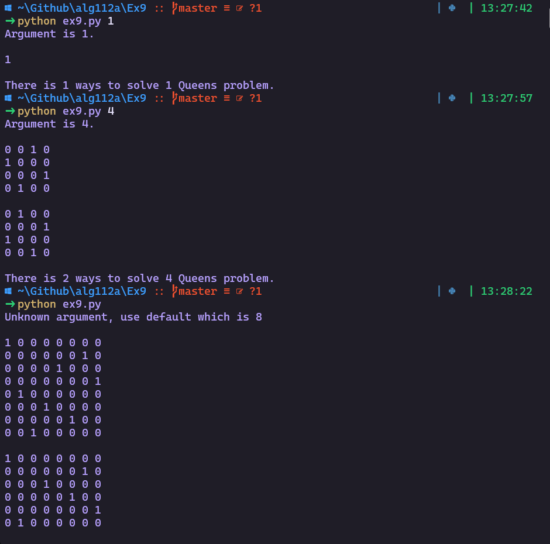

# EX9

## ChatGPT

* 提問：**請使用搜尋法解釋八皇后問題，用python**


* 以下是**ChatGPT**的回答：  
當談到八皇后問題時，使用搜尋算法，如深度優先搜索（DFS）或者廣度優先搜索（BFS），可以找到所有解。以下是使用深度優先搜索的 Python 實現：  

```python
def is_safe(board, row, col, N):
    # 檢查這一列的上方
    for i in range(col):
        if board[row][i] == 1:
            return False

    # 檢查左上方的對角線
    for i, j in zip(range(row, -1, -1), range(col, -1, -1)):
        if board[i][j] == 1:
            return False

    # 檢查左下方的對角線
    for i, j in zip(range(row, N, 1), range(col, -1, -1)):
        if board[i][j] == 1:
            return False

    return True


def solve_n_queens(N):
    def solve_n_queens_util(board, col):
        if col >= N:
            # 達到棋盤尾部，找到一個解
            solutions.append([row[:] for row in board])
            return

        for i in range(N):
            if is_safe(board, i, col, N):
                board[i][col] = 1
                solve_n_queens_util(board, col + 1)
                board[i][col] = 0  # 回溯

    board = [[0 for _ in range(N)] for _ in range(N)]
    solutions = []
    solve_n_queens_util(board, 0)

    # 打印所有解
    for solution in solutions:
        for row in solution:
            print(' '.join(map(str, row)))
        print()

    return len(solutions)


# 測試解八皇后問題
n = 8
num_solutions = solve_n_queens(n)
print(f"共有 {num_solutions} 種解法")
```

這段程式碼使用深度優先搜索來找到所有八皇后問題的解。它會找到並列印出所有可能的解，然後返回解的總數。這種方法適用於小規模的問題，但對於較大的棋盤尺寸可能會變得相當耗時。

## 改良
以此為基礎加上可計算N皇后問題的功能
* 使用方法
```
python ex9.py [n]
```
n 預設為 8 。
* 使用範例  
  
中間省略...  

